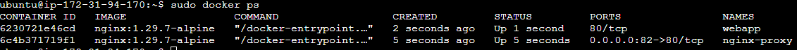
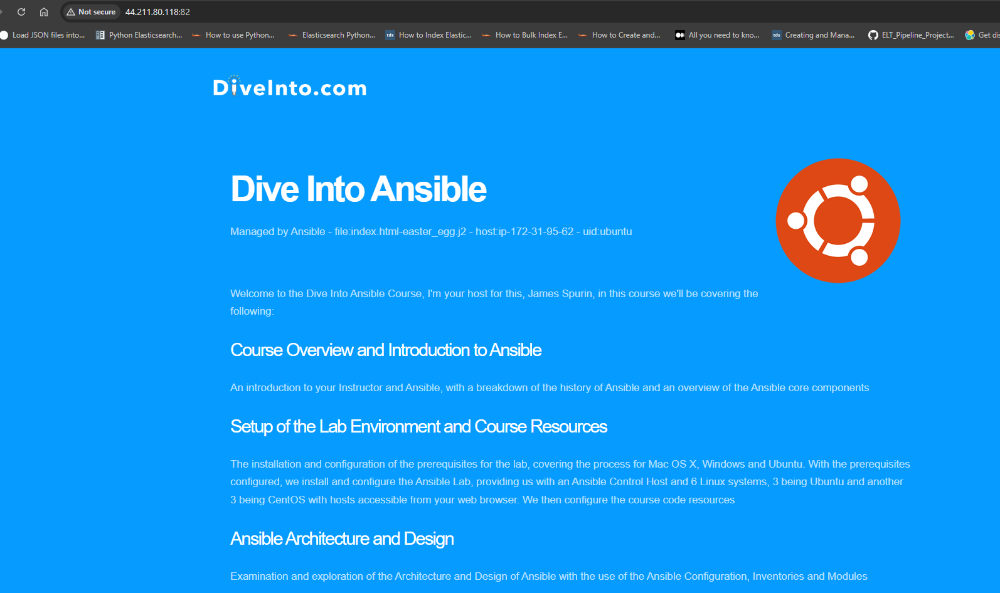

# 🚀 Deploy Application with Ansible

[](https://www.ansible.com/)
[](https://www.docker.com/)
[](LICENSE)

## 📋 Overview

This project demonstrates two deployment approaches using Ansible:

| Stage | Description | Technology |
|-------|-------------|------------|
| **Part 1** | Traditional deployment | Ansible + Nginx |
| **Part 2** | Containerized deployment | Ansible + Docker + Nginx Proxy |

## 🏗️ Architecture

### Part 1: Traditional Deployment

## ⚙️ Prerequisites

### AWS Infrastructure

| Resource | Description |
|----------|-------------|
| EC2 Instance #1 | Ansible Control Node (Ubuntu 22.04) |
| EC2 Instance #2 | Staging Server (Ubuntu 22.04) |
| EC2 Instance #3 | Production Server (Ubuntu 22.04) |
| Security Group | Allow inbound traffic on ports 22, 80, 82 |

### Security Group Configuration

| Type | Protocol | Port | Source |
|------|----------|------|--------|
| SSH | TCP | 22 | Your IP |
| HTTP | TCP | 80 | 0.0.0.0/0 |
| Custom TCP | TCP | 82 | 0.0.0.0/0 |

## 🛠️ Installation

### 1. Setup Ansible Control Node

```bash
# Update system
sudo apt update && sudo apt upgrade -y

# Install Ansible
sudo apt install -y ansible

# Install Docker
sudo apt install -y docker.io
sudo systemctl start docker
sudo systemctl enable docker
sudo usermod -aG docker $USER

# Install sshpass (for password-based SSH)
sudo apt install -y sshpass

# Verify installations
ansible --version
docker --version
```


### 2. Install Docker Collection for Ansible

```bash
# Check if collection is installed
ansible-galaxy collection list | grep docker

# Install if missing
ansible-galaxy collection install community.docker
```

### 3. Configure SSH Authentication

```bash
# Generate SSH key
ssh-keygen -t rsa -b 4096 -f ~/.ssh/ansible_key -N ""

# Copy public key to target servers
sshpass -p 'your_password' ssh-copy-id -o StrictHostKeyChecking=no \
  -i ~/.ssh/ansible_key.pub ubuntu@<STAGING_IP>

sshpass -p 'your_password' ssh-copy-id -o StrictHostKeyChecking=no \
  -i ~/.ssh/ansible_key.pub ubuntu@<PRODUCTION_IP>
```

### 4. Update Inventory

Edit `hosts.yml` with your server IPs:

```yaml
all:
  children:
    staging:
      hosts:
        client1:
          ansible_host: <STAGING_IP>
    prod:
      hosts:
        client2:
          ansible_host: <PRODUCTION_IP>
```

### 5. Test Connectivity

```bash
ansible all -m ping
```


## 🚀 Deployment

### Part 1: Traditional Deployment

Deploy the application directly on the target servers using Nginx.

```bash
cd app-init/

# Deploy to staging
ansible-playbook nginx_playbook.yml --limit staging

# Deploy to production
ansible-playbook nginx_playbook.yml --limit prod
```


**Access the application:**

http://<PUBLIC_IP>:80


---

### Part 2: Containerized Deployment

Deploy the application using Docker containers with Nginx as a reverse proxy.

```bash
cd app-template/

# Deploy to staging
ansible-playbook nginx_webapp_playbook.yml --limit staging

# Deploy to production
ansible-playbook nginx_webapp_playbook.yml --limit prod
```

**Verify containers are running:**

```bash
ssh ubuntu@<STAGING_IP> "sudo docker ps"
```

| Container | Image | Ports | Role |
|-----------|-------|-------|------|
| nginx-proxy | nginx:1.25-alpine | 0.0.0.0:82→80 | Reverse proxy |
| webapp | nginx:1.25-alpine | 80 (internal) | Web application |



**Access the application:**

http://<PUBLIC_IP>:82



## 📚 Ansible Roles

### Docker Role

Installs and configures Docker on target servers.

| Task | Description |
|------|-------------|
| Install prerequisites | ca-certificates, curl, gnupg |
| Add Docker repository | Official Docker APT repo |
| Install Docker | docker-ce, docker-ce-cli, containerd.io |
| Install Python SDK | python3-docker |

### Nginx Role

Configures Nginx as a reverse proxy in a Docker container.

| Task | Description |
|------|-------------|
| Stop system Nginx | Prevents port conflicts |
| Create Docker network | custom_net bridge network |
| Deploy proxy config | nginx.conf with upstream |

### Webapp Role

Deploys the web application content.

| Task | Description |
|------|-------------|
| Deploy index.html | Jinja2 template with dynamic content |
| Deploy game files | Playbook Stacker game assets |
| Start containers | webapp + nginx-proxy |
| Health check | Verify application accessibility |

## 🔧 Configuration

### Variables

| Variable | Default | Description |
|----------|---------|-------------|
| `app_port` | 82 | External port for the application |
| `container_name` | webapp | Name of the webapp container |
| `nginx_root_location` | /var/www/html | Document root path |

### Customization

Override variables in the playbook:

```yaml
roles:
  - role: webapp
    vars:
      app_port: 8080
      container_name: my-webapp
```

Or via command line:

```bash
ansible-playbook nginx_webapp_playbook.yml -e "app_port=8080"
```

## 🐛 Troubleshooting

| Issue | Solution |
|-------|----------|
| Port already in use | `sudo systemctl stop nginx` or change `app_port` |
| Docker permission denied | `sudo usermod -aG docker $USER` then logout/login |
| SSH connection failed | Verify SSH key and `ansible_host` in inventory |
| Container not starting | Check logs: `docker logs nginx-proxy` |

### Useful Commands

```bash
# Check playbook syntax
ansible-playbook nginx_webapp_playbook.yml --syntax-check

# Dry run
ansible-playbook nginx_webapp_playbook.yml --check

# Verbose output
ansible-playbook nginx_webapp_playbook.yml -vvv

# View container logs
ssh ubuntu@<IP> "sudo docker logs nginx-proxy"
ssh ubuntu@<IP> "sudo docker logs webapp"
```

## 📖 Resources

- [Ansible Documentation](https://docs.ansible.com/)
- [Docker Documentation](https://docs.docker.com/)
- [Nginx Documentation](https://nginx.org/en/docs/)
- [AWS EC2 Documentation](https://docs.aws.amazon.com/ec2/)

## 👤 Author

**Kevin Lagaza**

## 📄 License

This project is licensed under the MIT License - see the [LICENSE](LICENSE) file for details.
