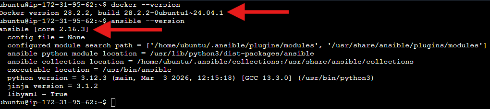
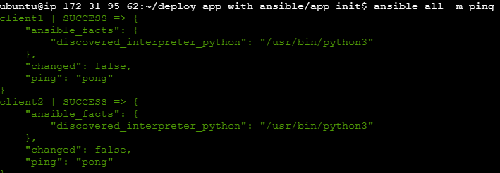
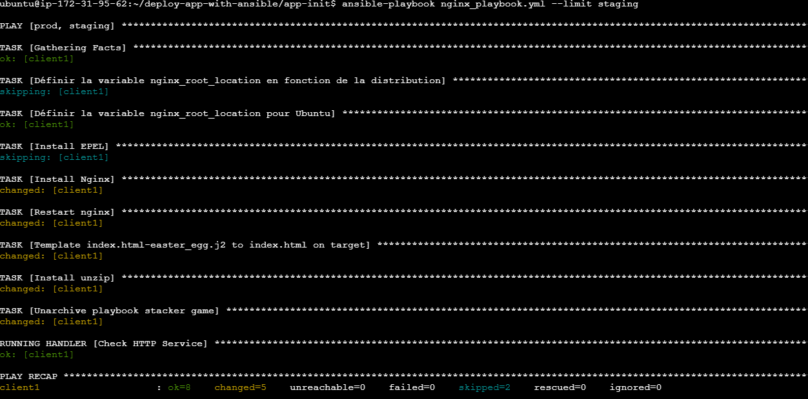
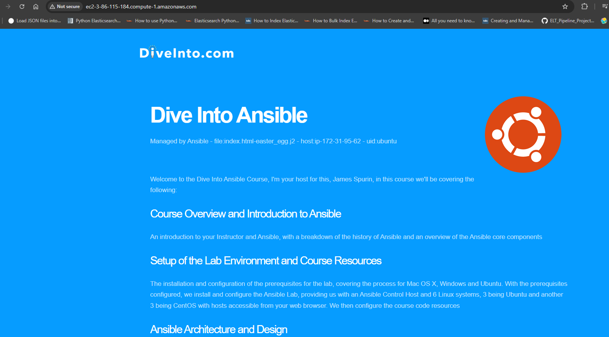

# Deploy an app via Ansible

## Getting started

.

## Prerequisites

- 1) Create an **AWS account** if not done yet.
- 2) Create two EC2 VMs for both staging and production environments.
- 3) Create an EC2 VM, then install both **Docker** and **Ansible** on the machine.

****

```bash
# Install sshpass
sudo apt update
sudo apt install sshpass

# Depending on whether your installed ansible or ansible-core, check that docker is included in the collection
ansible-galaxy collection list | grep docker
# If not, run the command below
ansible-galaxy collection install community.docker

# Generate an SSH key (if not done yet)
ssh-keygen -t rsa -b 4096 -f ~/.ssh/ansible_key -N ""

# Copy the public key to the target servers
sshpass -p 'password_user' ssh-copy-id -o StrictHostKeyChecking=no -i ~/.ssh/ansible_key.pub user_ansible@<IP_STAGING>
sshpass -p 'password_user' ssh-copy-id -o StrictHostKeyChecking=no -i ~/.ssh/ansible_key.pub user_ansible@<IP_PRODUCTION>

# Move to the folder
cd app-init/

# Test connectivity
ansible all -m ping
```

****

## Part 1: Deploy the app with a simple playbook file

Note that we will be using the app-init folder.

```bash
# Move to the folder
cd app-init/
# Execute server commands
ansible-playbook nginx_playbook.yml --limit staging
ansible-playbook nginx_playbook.yml --limit prod
```

****

Then, type **<PUBLIC_IP_ADRESS>:80** in your browser.

****

## Part 2 : Deployment of a containerized application et Nginx by using **ansible roles**

In this section, we are using the **app-template** folder.


```bash
cd app-template

ansible-playbook nginx_webapp_playbook.yml --limit staging
ansible-playbook nginx_webapp_playbook.yml --limit prod
```
